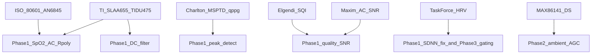

# PPG Algorithm Design References

**Last updated**: 2026-08-05  
**Audience**: firmware, clinical-engineering review  
**Related**: [PPG_ALGO_PARAMS_AND_SCHEDULING.md](PPG_ALGO_PARAMS_AND_SCHEDULING.md) · [subsys/ppg_algo/README.md](../../subsys/ppg_algo/README.md)

> **Disclaimer**: The standards, papers, and vendor notes below are **design references** that guide host-DSP implementation choices (AC definition, peak detection, SQI, R-curve form). Citing them does **not** transfer clinical clearance or accuracy claims. **NiSense remains wellness-grade** until Arms desaturation data and a **device-specific R-curve** exist. Do not treat any SpO2, HR, HRV, Hb, or BP output as a regulated medical measurement on the basis of this bibliography alone.

---

## 1. Chosen firmware direction

| Stage | Direction |
|-------|-----------|
| Peak / HR | Local-maxima + refractory (MSPTD/AMPD family, MCU-light); **green AC** on MAX86141 watch |
| SpO2 AC | RMS or peak-to-peak amplitude over beats/window (not last residual) |
| Quality | Maxim AC SNR + Elgendi skewness SQI; **motion rejection on** in product `ppg.conf` |
| SpO2 curve | AN6845-style R-polynomial when factory cal present; textbook linear only as explicit fallback |
| Publish UX | **Staged live**: HR/SpO2 ~12 s; full window 20 s; NOR at 500; live tail 0 |
| Hb / BP / HRV | Experimental host estimators; not hub BPT |

Acceptance for peaks: offline F1 vs [ppg-beats](https://github.com/peterhcharlton/ppg-beats) on logged NOR/CSV data.

Product windows, staging, and estimator floors: [PPG_ALGO_PARAMS_AND_SCHEDULING.md](PPG_ALGO_PARAMS_AND_SCHEDULING.md).

---

## 2. Current vs target gap matrix

| Domain | Pre-audit (legacy) | Target / post-2026-07-30 firmware |
|--------|--------------------|-----------------------------------|
| SpO2 AC | Last-sample residual | Window RMS / beat Pk-Pk amplitudes |
| SpO2 curve | `110−25R` only | Factory R-poly when present; linear fallback |
| DC filter | 8-sample MA (320 ms) | `CONFIG_PPG_ALGO_DC_WINDOW_SAMPLES` default 32 |
| Peak/HR | Threshold crossing | Local maxima + refractory |
| SDNN | Population `/n` | Sample `/(n−1)` (Task Force) |
| Hb R_gr | Truncated `/1000+1` | 64-bit intermediate ratio |
| Quality SNR | Variance of pulse | Maxim PAC / successive-diff residual + Elgendi skew |
| LED / ambient | Fixed PA, no ambient | DIRECT_AMBIENT SEQ + host AGC + factory PA seed |
| Cal | Affine only | R-poly + LED seed (melanin still skipped) |
| Motion | Soft penalty | Invalidate SpO2 / hold HR when `motion_rejection` |
| Claims | README ±2 | Wellness until Arms evidence |

---

## 3. Stage-to-reference mapping

| NiSense stage | Primary references |
|---------------|-------------------|
| SpO2 AC / R | TI SLAA655, TIDU475, Renesas OB1203 AN, Maxim AN6845, Biosensors 2021 |
| SpO2 cal / study | ISO 80601-2-61, Med Biol Eng Comput 2024, AN6845 / MAXREFDES101 |
| DC / preproc | TI SLAA655, TIDU475 |
| Peak / HR | Charlton 2022, MSPTDfast, ppg-beats, Scholkmann AMPD |
| Quality / motion | Maxim AC SNR specs, Elgendi 2016, TI SLAA655 motion |
| HRV labeling | ESC/NASPE Task Force 1996 |
| AFE ambient / AGC | MAX86141 datasheet, MAXREFDES101 / AN6845 workflow |

---

## 4. Bibliography

### 4.1 Standards

| Ref | URL | Use in NiSense |
|-----|-----|----------------|
| ISO 80601-2-61:2026 | https://www.iso.org/standard/84595.html | R → empirical SpO2 curve; Arms accuracy context; functional testers ≠ clinical accuracy |
| ESC/NASPE Task Force HRV (Circulation 1996) | https://www.ahajournals.org/doi/10.1161/01.CIR.93.5.1043 | SDNN/RMSSD definitions (sample SD); duration rules; PPG PRV ≠ ECG HRV |

### 4.2 SpO2 / ratio-of-ratios

| Ref | URL | Use in NiSense |
|-----|-----|----------------|
| TI SLAA655 — *How to Design SpO2 and OHRM Systems* | https://www.ti.com/lit/pdf/slaa655 | `R = (ACrms_red/DC_red)/(ACrms_ir/DC_ir)`; linear `110−25R` is illustration only |
| TI TIDU475 — AFE4400 pulse ox design | https://www.ti.com/lit/ug/tidu475/tidu475.pdf | AC/DC normalization pipeline; LED/PD tradeoffs |
| Renesas OB1203 pulse-oximeter algorithm AN | https://www.renesas.com/en/document/apn/ob1203-pulse-oximeter-algorithm-spo2-heart-rate-and-respiration-rate | Reflective PI (IR RMS); R from Pk-Pk or RMS; hypoxia-lab R-curve workflow |
| Maxim AN6845 — *Guidelines for SpO2 Measurement* | https://www.analog.com/en/resources/technical-articles/guidelines-for-spo2-measurement--maxim-integrated.html | Quadratic `a,b,c` form-factor cal; defaults not product-final |
| Maxim PPG Algorithms Specs | https://www.analog.com/en/resources/app-notes/maxim-integrated-ppg-algorithms-specifications.html | SpO2 @ 25 Hz; PI ≥ 0.2%; AC SNR = 20·log(PAC_pp / PNoise_rms); 20–30 s clean Red/IR |
| Biosensors 2021 (R extraction + green SQI) | https://mdpi-res.com/d_attachment/biosensors/biosensors-11-00521/article_deploy/biosensors-11-00521-v3.pdf | Robust R; green SQI outlier reject for wearables |
| Med Biol Eng Comput 2024 (skin tone / R-curve) | https://link.springer.com/content/pdf/10.1007/s11517-024-03091-2.pdf | Pigmentation / geometry shift R-curves; Arms demographics |

### 4.3 Beat / HR detection

| Ref | URL / DOI | Use in NiSense |
|-----|-----------|----------------|
| Charlton et al., Physiol Meas 2022 | DOI [10.1088/1361-6579/ac826d](https://doi.org/10.1088/1361-6579/ac826d) | MSPTD / qppg benchmark; local-maxima vs upslope |
| MSPTDfast (Charlton et al.) | https://iopscience.iop.org/article/10.1088/1361-6579/adb89e | Efficient MSPTD; ~20 Hz still strong F1 → fits 25 Hz MCU |
| ppg-beats toolbox | https://github.com/peterhcharlton/ppg-beats | Offline golden / F1 reference on logged CSV |
| Scholkmann AMPD | DOI [10.3390/a5040588](https://doi.org/10.3390/a5040588) | Multiscale peak detect; MSPTD ancestor |

### 4.4 Signal quality / motion

| Ref | URL | Use in NiSense |
|-----|-----|----------------|
| Elgendi 2016 — Optimal SQI for PPG | https://pmc.ncbi.nlm.nih.gov/articles/PMC5597264/ | Skewness SQI; 2–5 s windows |
| Maxim AC SNR | Same specs page as §4.2 | SNR from PAC peak-to-peak / noise RMS — not stddev of pulse |
| TI SLAA655 motion section | https://www.ti.com/lit/pdf/slaa655 | Accel-aided reject / hold when motion buries PPG |

### 4.5 AFE / vendor

| Ref | URL | Use in NiSense |
|-----|-----|----------------|
| MAX86141 datasheet | https://www.analog.com/media/en/technical-documentation/data-sheets/max86140-max86141.pdf | `DIRECT_AMBIENT` (0x09) LED_SEQ; LED PA FS; ALC / PPG_CONFIG |
| MAXREFDES101 / AN6845 workflow | AN6845 link in §4.2 | Form-factor SpO2 cal via I2C; coefficient loading |

---

## 5. Code & doc map

| Topic | Location |
|-------|----------|
| Windows, staged live, BLE `f01b`, health schedule | [PPG_ALGO_PARAMS_AND_SCHEDULING.md](PPG_ALGO_PARAMS_AND_SCHEDULING.md) |
| Subsystem API / RAW vs HUB / estimator math | [subsys/ppg_algo/README.md](../../subsys/ppg_algo/README.md) |
| SpO2 math | `subsys/ppg_algo/ppg_spo2_calc.c` |
| Peak detect | `subsys/ppg_algo/ppg_peak_detect.c` |
| Quality / SNR | `subsys/ppg_algo/ppg_quality.c` |
| Preproc / DC | `subsys/ppg_algo/ppg_preprocessing.c` |
| Hb | `subsys/ppg_algo/ppg_hb_calc.c` |
| Resp | `subsys/ppg_algo/ppg_resp_calc.c` |
| HRV / BP | `subsys/ppg_algo/ppg_hrv_bp_calc.c` |
| SFH LED start/stop | `max86141_ppg_leds_set`, `max32664_raw_drain_ppg` |
| Factory R-poly fields | `docs/hardware/FACTORY_CALIBRATION.md` |

---

## 6. Change log

### 2026-08-05

- Cross-linked staged live product path, green-HR watch path, motion-on defaults, experimental Hb/BP/HRV.

### 2026-07-30

- Initial bibliography, gap matrix, and stage-to-reference map from the PPG medical audit plan.
- Locked firmware direction: local-maxima peaks; RMS/Pk-Pk SpO2 AC; Maxim AC SNR + Elgendi SQI; AN6845 R-poly when cal present.
