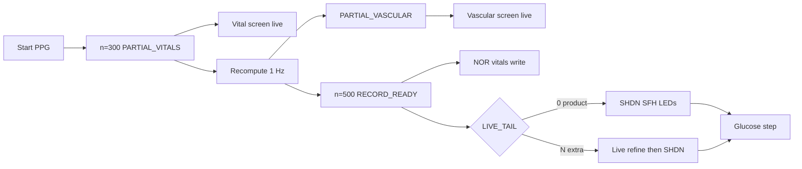

# PPG Algorithm Parameters, BLE Sampling & Health Scheduling

**Last updated**: 2026-08-05  
**Audience**: firmware, mobile, clinical-engineering review  
**Code**: `subsys/ppg_algo/`, `src/sensors/ppg.c`, `src/sensors/health_sched.c`, `src/ui/ui_agent.c`, `src/ble/ble_gatt.c` (`f01b`), `src/power/power_mgr.c`, `conf/features/ppg.conf`, `apps/mobile` Settings → Sampling

> **Disclaimer**: Windows and thresholds below are **engineering / standards-inspired heuristics** for wellness-grade wearables. They are **not** FDA/CE clinical claims or a certified medical protocol.

---

## 1. Why sample-rate and window length matter

| Quantity | Typical physiology | Sampling implication |
|----------|--------------------|----------------------|
| Heart rate | ~0.5–4 Hz (30–240 BPM) | 25 Hz gives ~3× Nyquist headroom over the upper band of interest |
| SpO2 AC pulse | needs ≥ ~10 Hz | 25 Hz is common in commercial wearables; aligns with ISO 80601-2-61 *context* (pulse ox accuracy discussions), not a clearance claim |
| Respiration from PPG | ~0.1–0.5 Hz (6–30 breaths/min) | Needs **many seconds** of amplitude-modulation history |
| HRV / RR intervals | want ~20 beats | At 60 BPM ≈ **20 s** of continuous clean PPG |

**Firmware default rate**: `CONFIG_PPG_ALGO_SAMPLE_RATE=25` (`conf/features/ppg.conf`).

**Sample count** (always):

\[
N = f_s \times T_{\text{seconds}}
\]

Examples @ 25 Hz: **12 s → 300**, **20 s → 500**.

---

## 2. RESP selects the buffer / acquisition window

Kconfig couples **respiration enable** to **minimum buffer and health-cycle acquisition**:

| Symbol | Role |
|--------|------|
| `CONFIG_PPG_ALGO_RESP_ENABLED` | IR pulse-amplitude respiration estimator (`ppg_resp_calc.c`) |
| `CONFIG_PPG_ALGO_BUFFER_SECONDS` | Circular algo history length |
| `CONFIG_APP_HEALTH_PPG_SECONDS` | Samples requested per health-cycle PPG step |
| BLE `f01b` default | `rate × BUFFER_SECONDS` when field is 0 / unset |

### Selection rule (menuconfig + defaults)

| `PPG_ALGO_RESP_ENABLED` | Buffer default / min | Health PPG seconds default / min | Count @ 25 Hz |
|-------------------------|----------------------|----------------------------------|---------------|
| **y** (product `ppg.conf`) | **20** (range 20–30) | **20** (range 20–30) | **500** |
| **n** | **12** (range 5–30) | **12** (range 8–30) | **300** |

Defined in:

- `subsys/ppg_algo/Kconfig` — `PPG_ALGO_BUFFER_SECONDS` / `PPG_ALGO_RESP_ENABLED`
- top-level `Kconfig` — `APP_HEALTH_PPG_SECONDS`
- `src/ble/ble_gatt.c` — `BLE_PPG_SAMPLE_COUNT_DEFAULT`

`conf/features/ppg.conf` sets `CONFIG_PPG_ALGO_RESP_ENABLED=y` and
`CONFIG_PPG_ALGO_BUFFER_SECONDS=20` together (required: Kconfig defaults alone
can leave a stale `.config` at 12 s while RESP is on, failing `BUILD_ASSERT`).

Build guard: `ppg_resp_calc.c` `BUILD_ASSERT(BUFFER_SECONDS >= 20)` when RESP is compiled in.

### Why 12 s (RESP off) — HR / SpO2 “ready” window

| Source / practice | Guidance used in Kconfig help |
|-------------------|-------------------------------|
| ANSI/AAMI **EC57** | ~**10 s** reference ECG/PPG-style strips for analysis discussion |
| PPG peak-detect literature (Pan–Tompkins variants) | Often **8–15 s** to converge on stable peaks |
| Product choice | **12 s @ 25 Hz = 300 samples** as minimum stable HR/SpO2 report window |

### Why 20 s (RESP on) — respiration + HRV-adjacent floor

| Requirement | Why |
|-------------|-----|
| Resp band **6–30 brpm** (`RESP_MIN_BPM` / `RESP_MAX_BPM`) | At **6 brpm**, period = **10 s** → **20 s ≈ 2 breath cycles** (algorithm floor in `ppg_resp_calc.c`) |
| Envelope on IR AC (~0.1–0.5 Hz) | Short windows alias / under-count breaths |
| ~20 RR intervals @ 60 BPM | Same **20 s** ballpark useful for HRV-style / vascular estimates on longer captures |

**How the algo uses it**: respiration follows IR AC amplitude modulation with an envelope follower, then peak-counts in the valid brpm band. Without ≥20 s of valid samples it will not produce a trustworthy RR.

**How acquisition must match**: health-cycle and BLE defaults use the same RESP-gated seconds so the device **fills** the buffer instead of stopping at 12 s while the buffer expects 20 s.

---

## 3. What each algorithm needs (summary)

| Algorithm | File | Floor / gate | Notes |
|-----------|------|--------------|--------|
| HR (R–R) | `ppg_hr_calc.c` | ≥3 RR after quality gate; ready ~8–12 s | MAX86141 RAW: peaks on **green AC** (required); MAX3010x: IR AC |
| SpO2 (R-value) | `ppg_spo2_calc.c` | ~8–12 s clean Red/IR | Window RMS / beat Pk-Pk AC; quality gate; factory R-poly when present |
| Quality / PI | `ppg_quality.c` | same as capture | IR-primary PI/SNR; motion flag |
| Hemoglobin | `ppg_hb_calc.c` | `green_valid` (DC/AC) | Linear green/IR model; range 8.0–18.0 g/dL ×10; experimental |
| Respiration | `ppg_resp_calc.c` | **≥20 s** IR AC | Enforced by Kconfig range + `BUILD_ASSERT` |
| HRV (SDNN/RMSSD) | `ppg_hrv_bp_calc.c` | **≥20 RR** | Borderline on 20 s @ ~60 BPM |
| Cuffless BP | `ppg_hrv_bp_calc.c` | estimate OK **and ≥10 RR** | Empiric PAR/HR model — not clinical |
| Health-cycle PPG | `health_sched.c` | `APP_HEALTH_PPG_SECONDS` | `PPG_CYCLE_SAMPLES = rate × seconds` |
| BLE / UI override | `ble_gatt` `f01b` | 50–2000 samples | Persisted; `0` restores Kconfig default |

### Per-estimator math (host RAW path)

| Estimator | Inputs | Core formula / rule |
|-----------|--------|---------------------|
| **HR** | Peak times on green (86141) or IR (3010x) | Filter ectopic RR (±30% mean); `HR = 60000 / mean(RR_ms)` |
| **SpO2** | Window `AC_red/ir`, `DC_red/ir` | `R = (AC_r/DC_r)/(AC_i/DC_i)`; factory poly or `110 − 25·R` |
| **Hb** | `DC/AC` green + IR (+ red for SpO2R) | `R_gr = (AC_g/DC_g)/(AC_i/DC_i)`; `tHb = K1·R_gr + K2·SpO2R + K3` (Kconfig ×10 coeffs) |
| **Resp** | IR AC buffer ≥20 s | Envelope of IR AC amplitude; peak-count in 6–30 brpm |
| **HRV** | RR history | SDNN = sample stddev of RR; RMSSD = stddev of successive ΔRR |
| **BP** | HR + IR(/Red) perfusion ratio | Empiric MAP/PP from HR + PAR → SYS/DIA clamps |

Quality gate (`ppg_apply_quality_gate`): low perfusion, motion (when `MOTION_REJECTION=y`), SNR/poor quality, &lt;3 RR, out-of-range HR/SpO2, or confidence &lt; `QUALITY_THRESHOLD` clear `hr_valid` / `spo2_valid`. MAX86141 without plausible green also clears `hr_valid` / `hb_valid`.

---

## 3a. Staged live measurement (product path)

`CONFIG_PPG_ALGO_STAGED_LIVE=y` in `conf/features/ppg.conf`. The watch publishes metrics as floors are met instead of waiting for a blank screen until N samples.

### Timeline @ 25 Hz (defaults)

| Sample `n` | Wall time | Event | UI / side effects |
|------------|-----------|-------|-------------------|
| **300** | ~12 s | `PPG_TRIG_PARTIAL_VITALS` → `UI_EVENT_PPG_PARTIAL_VITALS` | Auto-nav **Vital**; live HR/SpO2 cards; BLE vitals notify |
| **300…500** | refine | Recompute ~1 Hz (`n % 25 == 0`) | Cards refresh while sampling continues |
| When Hb/BP/HRV/Resp valid **or** `n ≥ 500` | ≤20 s | `PPG_TRIG_PARTIAL_VASCULAR` | Auto-nav **Vascular**; live SDNN/BP cards |
| **500** (`record_target`) | 20 s | `PPG_TRIG_RECORD_READY` | Authoritative NOR `VITALS` + raw chunks; SFH AFE still on only if live tail &gt; 0 |
| **500 + LIVE_TAIL** (`session_target`) | — | `PPG_TRIG_MEASUREMENT_COMPLETE` | Hub SHDN + LED PA off; health_sched → glucose → Metabolic → slideshow |

### Targets and RAM

| Symbol | Product default | Meaning |
|--------|-----------------|---------|
| `record_target` | `BUFFER_SECONDS × rate` = **500** | Authoritative capture length; NOR write |
| `session_target` | `record_target + LIVE_TAIL` | When AFE stops and `MEASUREMENT_COMPLETE` fires |
| `CONFIG_PPG_ALGO_PARTIAL_VITALS_SAMPLES` | **300** | Early HR/SpO2 |
| `CONFIG_PPG_ALGO_LIVE_TAIL_SAMPLES` | **0** | Extra samples after record-ready |

**Why live tail is 0:** the watch window (500) is enough to *run* every enabled estimator. An optional tail (e.g. 200) was useful for UI refine but kept SFH7074 LEDs on and burned power. Set `LIVE_TAIL_SAMPLES` &gt; 0 only for experiments; `record + tail ≤ PPG_MAX_SAMPLES` (800).

**Buffer capacity:** sample arrays are allocated for `record_target` only (~500). After the window is full, `ppg_samples_add` returns `-ENOMEM` (treated as OK): peak/preproc continue for refine, but NOR/CSV use the first 500. A 700-sample multi-channel buffer OOMs on nRF52840 with `PPG_LOG_DC_AC`.

### SFH / MAX86141 LED lifecycle

| Phase | Behaviour |
|-------|-----------|
| Start | Hub `SAMPLING_FREQUENCY` start → host `max86141_ppg_leds_set(true)` + exit SHDN |
| Sampling | SFH7074 Green/Red/IR pulse at product LED_SEQ |
| Stop (`finalize` / `ppg_algo_stop`) | Accel feeder stop → hub attr stop → `leds_set(false)` + `SYSTEM_CTRL` SHDN |
| Guard | `max32664_raw_drain_ppg` **must not** restore PA when `hub_data->sampling == false` (late fetch race) |

Log marker: `PPG sensor shutdown (SFH LEDs off)`.

### UI navigation during PPG

With staged live, `ui_is_navigation_blocked()` **does not** lock the carousel for PPG / health-cycle busy — auto-nav already moves Vitals → Vascular → Metabolic, and compiled fonts no longer need a NOR touch-lock. **Glucose ADC** still blocks swipes briefly. Without `STAGED_LIVE`, the legacy PPG/health busy lock remains.

### Triggers / events map

| Algo trigger | UI event | Primary consumers |
|--------------|----------|-------------------|
| `PPG_TRIG_PARTIAL_VITALS` | `UI_EVENT_PPG_PARTIAL_VITALS` | `ui_agent`, BLE vitals |
| `PPG_TRIG_PARTIAL_VASCULAR` | `UI_EVENT_PPG_PARTIAL_VASCULAR` | `ui_agent` |
| `PPG_TRIG_RECORD_READY` | `UI_EVENT_PPG_RECORD_READY` | stay on vascular; NOR already written |
| `PPG_TRIG_MEASUREMENT_COMPLETE` | `UI_EVENT_MEAS_RESULT_READY` (vitals) | health_sched → glucose; UI “Done” |

Code: `ppg_maybe_advance_staged` / `ppg_compute_raw_result_locked` / `ppg_do_record_ready` in `ppg_algo.c`; dispatch in `src/sensors/ppg.c`; nav in `src/ui/ui_agent.c`.

---

## 4. BLE sampling / schedule config (`f01b`)

**UUID**: `12345678-1234-5678-1234-56789abcf01b`  
**Layout**: 12 bytes LE (`struct ble_sampling_config` in `ble_gatt.h`)

| Offset | Field | Meaning |
|--------|-------|---------|
| 0 | `ppg_sample_count` u16 | PPG samples for next BLE-started / override path; **0** → Kconfig default |
| 2 | `glucose_num_samples` u16 | ADC samples 10–500 |
| 4 | `glucose_delay_ms` u16 | Inter-sample / LED delay |
| 6 | `flags` u8 | bit0 `BLE_SAMP_FLAG_DISABLE_PROX` — persistent proximity bypass (bench/test) |
| 7 | `auto_enabled` u8 | Health auto-schedule on/off |
| 8 | `schedule_interval_sec` u16 | **0** = adaptive ladder; else fixed **60–3600 s** |
| 10 | `current_interval_sec` u16 | **Read:** effective interval now (ladder step or fixed). **Write:** ignored |

**Persistence**: `config_manager` → NVS `cm/app` / `config_ppg` (`sample_count`, glucose knobs, flags, `health_auto_enabled`, `health_interval_sec`). Older smaller blobs still load.

**Apply path**: write `f01b` → clamp → `glucose_set_config` / `ppg_set_proximity_disabled` / `health_sched_set_*` → persist. Boot: load NVS → apply.

**Related**: PPG BLE stream decimate remains on **`f012`**.

**Mobile**: Settings → **Sampling (test)** — sliders + auto schedule + “Use adaptive ladder”.

Shell: `nisense cfg show` prints `ppg.*` including `health_auto` / `health_int_s`.

---

## 5. Adaptive measurement schedule

Implemented in `health_sched.c`.

### Ladder (seconds)

| Index | Interval | Minutes |
|-------|----------|---------|
| 0 | 300 | 5 |
| 1 (default) | 600 | 10 |
| 2 | 900 | 15 |
| 3 | 1200 | 20 |
| 4 | 1800 | 30 |

- **Adaptive (`schedule_interval_sec = 0`)**: glucose level / RoC and battery SOC move the ladder index (tighten toward 5 min; relax toward 30 min with hysteresis).
- **Fixed (BLE/test)**: `health_sched_set_interval_sec(sec)` clamps 60–3600; **skips** `cadence_evaluate` ladder updates; timer always uses the fixed value.
- Interval arms from **end of cycle** (auto or manual) when auto is on and worn.

Wear gate: VCNL3040 (unless proximity disabled via `f01b` flag).  
`WORN_GOOD` requires proximity **≥ ~30k** on current hardware (skin); table/air stay below — see `vcnl3040.c`.

---

## 6. Display wake after measurement complete

Long cycles can exceed screen idle timeout. On `HEALTH_STEP_DONE`, `health_sched` calls `power_mgr_activity_notify()` **before** `UI_EVENT_MEAS_CYCLE_COMPLETE` so:

1. Panel wakes if asleep (`display_wake`)
2. Idle timer resets
3. UI agent slideshow / results remain visible

---

## 7. Product defaults (wearable `ppg.conf` path)

| Item | Value |
|------|--------|
| Sample rate | 25 Hz |
| RESP / HB / BP / HRV | **enabled** (HB/BP experimental) |
| Motion rejection | **enabled** (LIS2DS12 @ 25 Hz paired) |
| Buffer / health / BLE default | **20 s / 500 samples** (via RESP) |
| Staged live | **y** — partial vitals @ 300, record @ 500 |
| Live tail | **0** — stop AFE / SFH at record count |
| Adaptive schedule | on; ladder default 10 min |
| Fixed schedule | optional via `f01b` / app |
| Wi‑Fi feature | **off** (`CONFIG_APP_FEATURE_WIFI=n`) — BLE-only sync hold |

To run a **12 s / 300** product profile: disable RESP in menuconfig (or overlay); buffer and health defaults drop to 12 automatically. Do **not** force `BUFFER_SECONDS=12` while RESP=y (build assert / invalid RR).

---

## 8. Code & doc map

| Topic | Location |
|-------|----------|
| Buffer ↔ RESP Kconfig | `subsys/ppg_algo/Kconfig` |
| Staged live / live tail | `PPG_ALGO_STAGED_LIVE`, `PARTIAL_VITALS_SAMPLES`, `LIVE_TAIL_SAMPLES` |
| Health seconds ↔ RESP | `Kconfig` (`APP_HEALTH_PPG_SECONDS`) |
| Overlay | `conf/features/ppg.conf` |
| Staged compute + finalize | `subsys/ppg_algo/ppg_algo.c` |
| Triggers → UI/BLE | `src/sensors/ppg.c` |
| Auto-nav | `src/ui/ui_agent.c` |
| Live cards | `src/ui/vitals_ui.c`, `src/ui/vascular_ui.c` |
| Swipe lock policy | `src/ui/ui.c` (`ui_is_navigation_blocked`) |
| SFH LED stop / drain guard | `ppg_sensor_shutdown`, `max32664_raw_drain_ppg` |
| Cycle SM + ladder + wake | `src/sensors/health_sched.c` |
| BLE `f01b` + persist | `src/ble/ble_gatt.c`, `config_manager.*` |
| Resp / Hb / HRV·BP | `ppg_resp_calc.c`, `ppg_hb_calc.c`, `ppg_hrv_bp_calc.c` |
| NOR pipeline timing | [MAX32664C_PPG_NOR_PIPELINE.md](MAX32664C_PPG_NOR_PIPELINE.md) |
| Vitals export zeros | §9 below |
| Design refs | [PPG_ALGO_DESIGN_REFERENCES.md](PPG_ALGO_DESIGN_REFERENCES.md) |
| Subsystem API | [subsys/ppg_algo/README.md](../../subsys/ppg_algo/README.md) |
| UI UX | [UI_GUIDE.md](../ui/UI_GUIDE.md) |

---

## 9. Why many Vitals export fields are zero

Export (CSV / XLSX) writes the NOR `rec_vitals` payload as stored. Zeros usually mean
**algo validity failed**, not a broken exporter. Fields are still written when invalid
(value left at 0; validity lives in `flags` / confidence, not blanked cells).

Default product window: **20 s @ 25 Hz = 500 samples** (`CONFIG_PPG_ALGO_QUALITY_THRESHOLD=50`).
Staged live publishes early UI values, but the **NOR row is written at RECORD_READY (500)**.

| Export column | When it stays 0 / looks wrong |
|---------------|-------------------------------|
| **Hb_g_dL** | Needs `green_valid` (green LED DC/AC) and model in 8–18 g/dL. Missing green or out-of-range coeffs → 0. Watch logs: `Hb pending` / `Hb skipped`. |
| **SDNN_ms / RMSSD_ms** | HRV needs **≥20 RR intervals** (`HRV_MIN_RR_INTERVALS`). In 20 s at ~60 BPM you get ~19 RRs; lower HR or missed peaks (low `HR_Conf`) → 0. |
| **Sys_mmHg / Dia_mmHg** | BP estimate OK **and ≥10 RR intervals**. Same short/noisy window → 0. UI may show a provisional SYS/DIA with attention styling before `bp_valid`. |
| **Resp_BPM** | Needs ≥20 s IR AC and result in 6–30 brpm; otherwise 0 (can succeed on a clean capture). |
| **Quality / SNR_dB_x10** | Quality is enum `0…4` (`0 = NO_SIGNAL`). SNR estimator often ~0 when pulse variance is treated as noise → quality forced to 0 even if **Perf_x10** and HR look fine. |
| **HR / SpO2 values with low Conf** | Conf below 50 → `hr_valid` / `spo2_valid` false; numbers may still appear in the row. |

Also normal in exports:

- **Patient** = `Patient` — phone default name if none saved in Settings.
- **Measurement_ID** starting at 0 — first measurement after clear / new session.
- **Mobile Excel time** — epoch ms already encodes local civil time from CTS; exporters must **not** call `.toLocal()` again (see `apps/mobile/lib/util/record_timestamp.dart`).

**Code**: `subsys/ppg_algo/ppg_algo.c` (compute / finalize), `ppg_hrv_bp_calc.c`, `ppg_hb_calc.c`, `ppg_resp_calc.c`, `ppg_quality.c`; logger `src/sensors/ppg_logger.c`; mobile `apps/mobile/lib/services/record_*_exporter.dart`.

---

## 10. Medical-grade audit note (2026-07-30)

Host DSP was audited against ISO 80601-2-61 context, TI/Maxim SpO2 guidance, Charlton beat-detector benchmarks, and Elgendi SQI. Critical gaps (instantaneous SpO2 AC, threshold-crossing peaks, 8-sample DC, circular SNR, population SDNN, unused motion_rejection, fixed LED / no ambient SEQ) and the improvement roadmap live in:

→ [PPG_ALGO_DESIGN_REFERENCES.md](PPG_ALGO_DESIGN_REFERENCES.md)

NiSense remains **wellness-grade** until Arms desaturation data and a device-specific R-curve exist. Do not treat README or export fields as clinical claims.

---

## 11. Change log

### 2026-08-05

- Documented **staged live** (`PARTIAL_VITALS` @ 300, `PARTIAL_VASCULAR`, `RECORD_READY` @ 500).
- Product **`LIVE_TAIL_SAMPLES=0`**: stop SFH LEDs at required count; RAW drain must not resurrect PA after stop.
- Enabled product HB/BP/HRV + motion rejection; buffer capacity = record window only.
- UI: swipe allowed during staged PPG; battery pack-fault strip uses drawn outline + `!`.
- Algorithm floors table + Hb/BP/HRV math summary; mobile timestamp double-offset note.

### 2026-07-30

- Added design-references doc and medical-grade audit cross-link.
- Host DSP fixes: DC window ≥32, local-maxima peaks, windowed SpO2 AC, Maxim-style SNR, sample SDNN, factory R-poly apply, ambient SEQ + host AGC path.

### 2026-07-27

- MAX86141 wearable path always drives Green+Red+IR; HR peaks on green AC; SpO2 stays Red/IR.
- Documented why Hb / HRV / BP / Quality / SNR often export as zero on the 20 s window.

### 2026-07-24

- BLE `f01b` extended for auto schedule + fixed/adaptive interval; NVS persist.
- Screen wake on measurement cycle complete.
- `PPG_ALGO_BUFFER_SECONDS` / `APP_HEALTH_PPG_SECONDS` defaults and mins follow `PPG_ALGO_RESP_ENABLED` (20 vs 12).
- Proximity `WORN_GOOD` floor raised for bench false-wear; optional persistent prox disable for test.
