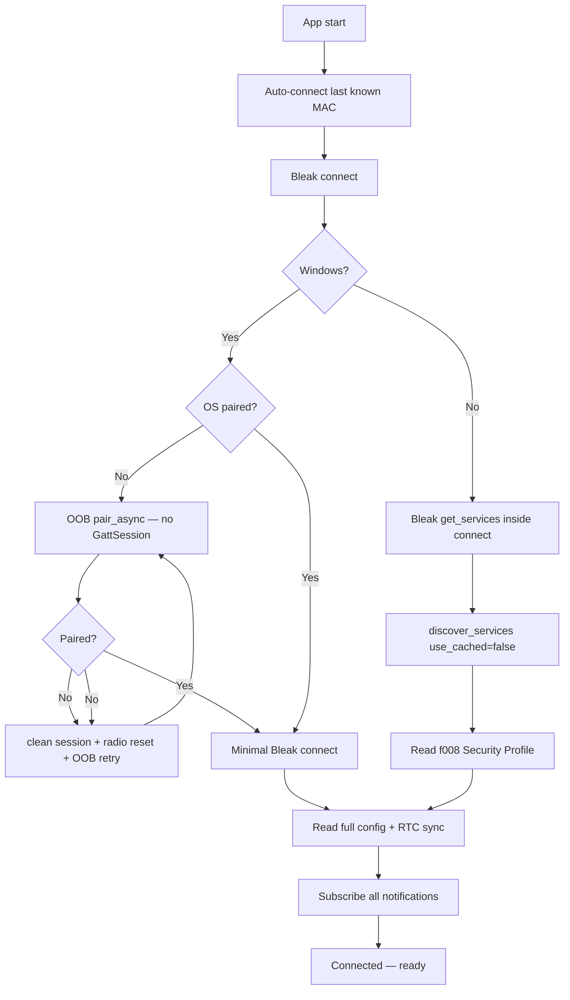
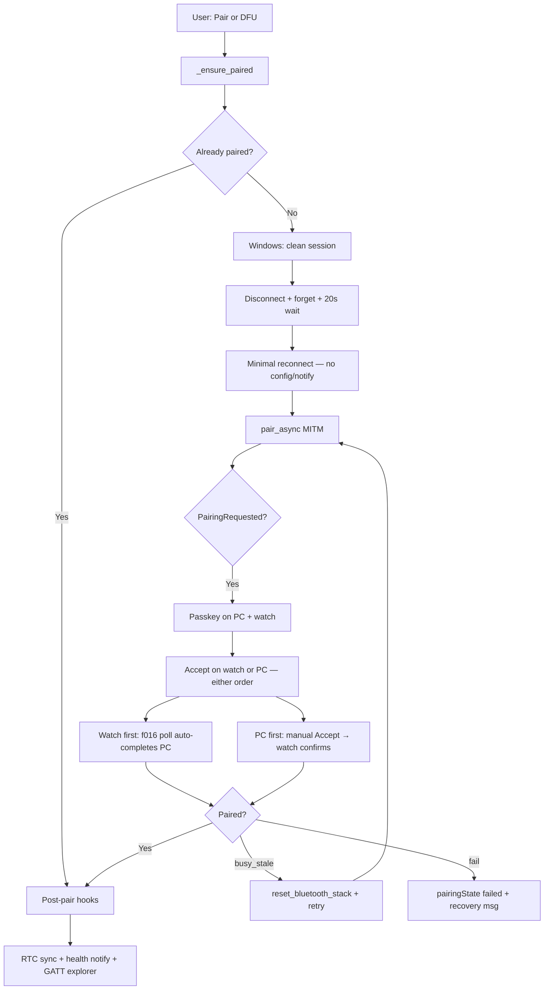

# BLE Monitor — Connection and Pairing Flow

Authoritative flow for the Windows/Linux BLE monitor (`apps/pc/hcm_monitor.py`).
See also [apps/pc/README.md](../../apps/pc/README.md) for setup and troubleshooting.

## Connect (link vs health data)

The BLE link connects without pairing. Whether health telemetry arrives depends on **Security Profile (`f008`)**:

- **OPEN (0)** — dev overlay `conf/features/ble_open.conf`; dashboard works unpaired.
- **SECURE (1)** — production default; unpaired connect gets **Measurement Status** only; MITM pair required for vitals/glucose/PPG.

Pairing is always required for WiFi SSID (L3), DFU/SMP, and SECURE-profile health notify CCCs.



### OPEN profile (dev)

| Gate | Intent |
|------|--------|
| Connect without pair | Config reads and all notification CCCs use non-encrypted permissions; dashboard works immediately. |
| WiFi SSID on Windows | Skipped when `is_paired_session()` is false — L3 read can start a rogue OS pairing ceremony. |

### SECURE profile (production)

| Gate | Intent |
|------|--------|
| `f008` first | Read Security Profile before other config; drives monitor skip sets and subscribe gating. |
| Windows SECURE unpaired | **One connect, then `pair_async`** on the live link (same as nRF Connect). No disconnect/forget before first pair attempt. Clean-session + radio bounce only on ``busy_stale``. |
| Encrypted config | Deferred until after pair (L2). **Brightness/volume** stay L1 OPEN and load after pair. |
| WiFi SSID | L3 AUTH — skipped on Windows while unpaired. |
| Notification subscribe | Unpaired: `f011` Measurement Status only. After pair: operational + health streams. |
| GATT explorer | `discover_gatt(security_profile)` skips encrypted/authenticated UUID reads while unpaired on Windows. |

### Common gates

| Gate | Intent |
|------|--------|
| Handler before GATT | On Windows, `PairingRequested` must be registered **before** Bleak's in-connect `get_services()`. Implemented via `bleak_connect_with_pairing_handler()` in `winrt_pairing.py`. |
| Link-only GATT pre-pair | After OOB bond, Bleak connect skips link-only when OS already paired; unpaired fallback still uses service-list-only. |
| OOB pair (Windows SECURE) | ``pair_async`` on ``BluetoothLEDevice`` **before** ``GattSession`` / ``get_gatt_services_async``. In-connect GATT wedges WinRT in ``OPERATION_ALREADY_IN_PROGRESS``. |
| GATT refresh after connect | When already paired, `discover_services()` runs `get_services(use_cached=False)` so a firmware reflash with new UUIDs is picked up. **Skipped while unpaired on Windows** — a second uncached discovery can provoke implicit Just Works pairing. |
| Reject implicit CONFIRM_ONLY | During connect/GATT, Windows may fire `PairingRequested` with `CONFIRM_ONLY` (Just Works). Handler **completes deferral without `accept()`** so MITM `pair_async` can run later. Returning without deferral wedges Windows until reboot. |

## Pairing (user-initiated or DFU)

Pairing is **not** completed during connect. It runs when:

- User taps **Pair** on the Firmware page or Dashboard banner, or
- User starts **DFU** (`_ensure_paired` before SMP upload).

On **Windows SECURE**, `_ensure_paired()` tries **`pair_async` on the current link** first; clean session (disconnect → forget → reconnect) runs only if WinRT returns ``busy_stale`` / ``busy``.



### Gate rules

| Gate | Intent |
|------|--------|
| Clean session forget | PC bond cleared **while BLE link is still up** (`forget_device_pairing(..., bleak_client=)`). If already paired, firmware `admin_delete_bonds` runs first. |
| `pair_async` once per clean session | Only from explicit Pair / DFU after minimal reconnect. Never during initial full connect. |
| Watch bond (unpaired PC) | `admin_delete_bonds` needs L3 — unavailable when unpaired. Tap **Forget** on the watch BLE screen before Pair if the watch still shows a bond. |
| Passkey UI | `PairingRequested` → `pairingPasskey` + global dialog in `main.qml`. Watch navigates to BLE screen via `ui_global_pairing_cb`. |
| Accept order | **Either order** (same as nRF Connect numeric comparison). Watch **Accept** first → monitor polls **CHRC f016** and auto-completes WinRT on PC. PC **Accept** first → user confirms on watch BLE screen. |
| No blind PC auto-accept | PC never accepts WinRT without user **Accept** or watch f016 `BLE_PAIRING_BONDING` (fixes the old 2 s auto-accept race). |
| Manual disconnect during pair | `_manual_disconnect` set during clean session so auto-reconnect does not race pairing. |

### Firmware pairing states

| State | Watch UI | PC |
|-------|----------|-----|
| `CONFIRM_PASSKEY` | Show 6-digit code + Accept/Reject | Dialog opens when pin arrives |
| `BONDING` | Hint: confirm on PC | `pairingBusy` after Accept |
| `COMPLETE` | Paired & connected | Dialog closes, health streams on |
| `FAILED` | Pairing failed banner | `pairingState failed`, recovery toast |

## Recovery

| Symptom | Action |
|---------|--------|
| `busy_stale` / no `PairingRequested` | App auto-runs `reset_bluetooth_stack` once; if still stuck, **Reset BT** or reboot PC. |
| `OPERATION_ALREADY_IN_PROGRESS` | Watch **Forget** → PC **Clear PC Bond** → wait 30 s → Connect → **Pair once**. |
| Last resort | `python reset_ble_pairing.py <MAC> --full-reset --restart-bthserv` (Admin) |

`ALREADY_UNPAIRED` from forget is normal; it does not clear an in-flight ceremony by itself.

## Disconnect and reconnect

| Event | Behaviour |
|-------|-----------|
| Device drop | Auto-reconnect with backoff (blocked during pairing / connect setup) |
| Manual disconnect | No auto-reconnect |
| Disconnect during **clean-session pair** | **Expected** on Windows — forget runs while link is up; log shows `link phase:` transitions |
| Disconnect during **bonding** | Monitor reconnects once, checks OS bond, or retries `pair_async` before failing |
| Pairing handler | Detached on teardown; re-attached on next connect via hook |

### Debug logging

```powershell
python hcm_monitor.py --debug
```

Sets DBG on `hcm_client`, `hcm_backend`, `winrt_pairing`, and `bleak` for connect/pairing diagnosis.

## Bond management

| UI label | API | Effect |
|----------|-----|--------|
| **Unpair All** | `unpairDevice` | Firmware `admin_delete_bonds` + Windows unpair + remove from list |
| **Remove** | `forgetDevice` | Remove from known list only |
| **Clear PC Bond** | `forgetPairing` | Windows WinRT unpair only |
| **Reset BT** | `recoverWindowsPairing` | Clear PC bond + radio bounce (+ optional bthserv restart) |

## Files

| File | Role |
|------|------|
| `hcm_monitor.py` | Qt entry point (`apps/pc/`) |
| `hcm_backend.py` | Connect orchestration, clean-session pairing, DFU |
| `hcm_client.py` | Bleak wrapper, `winrt_pairing_attach` on connect |
| `winrt_pairing.py` | WinRT pairing session, forget/reset helpers |
| `src/ble/ble_gatt.c` | SMP auth callbacks, passkey state |
| `src/ble/ble_ui.c` | Watch pairing screen |
| `src/ui/ui.c` | Auto-navigate to BLE screen on pairing events |
| `reset_ble_pairing.py` | CLI pairing recovery |
