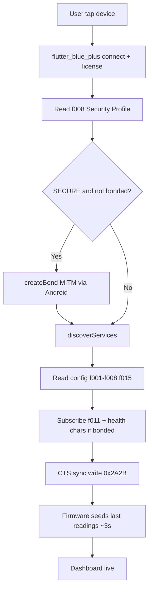

# BLE Monitor — Android Flow

Authoritative connect/pair/subscribe flow for the Flutter app (`apps/mobile`).

**Platform guide:** [PLATFORM_GUIDE.md](../guides/PLATFORM_GUIDE.md) — firmware flash, screens, shell, Excel.  
**Build environment (from scratch):** [apps/mobile/README.md](../../apps/mobile/README.md) — Flutter SDK, Android Studio, JDK 17, SDK components, `local.properties`, device setup, first APK.

**Prerequisites on the phone:** Android **10+ (API 29)**, SECURE firmware, BLE permissions granted (Location on API 29–30; Nearby devices on API 31+).

## Connect (SECURE production firmware)



## Gates (same intent as PC)

| Gate | Android behavior |
|------|------------------|
| `f008` first | Drives encrypted/authenticated skip sets |
| Unpaired SECURE | Subscribe **Measurement Status (`f011`) only** |
| After bond | Vitals, glucose, glucose algo, PMIC, proximity, sensor_all |
| WiFi SSID/password | Read/write only when bonded (L3) |
| DFU/SMP | Requires bond before SMP writes |

## Pairing

Android handles MITM numeric comparison in the system UI (same model as nRF Connect on phone). The app polls `f016` Pairing Status for passkey display on the Dashboard.

## Last-reading seed (post-connect)

~3 s after connect, firmware (`ble_gatt_seed_from_last_results`):

1. Loads NVS `home/last`.
2. Fills gaps from latest `RECORD_TYPE_VITALS` / `GLUCOSE` via `record_store_read_latest_type`.
3. Optionally fills insulin/HOMA from fasting insulin + last glucose.
4. Re-schedules GATT snapshot notifies for subscribed clients (CCC often pushed empty cache at ~750 ms before seed).

Dashboard cards merge non-zero fields so later empty `sensor_all` slices do not wipe prior values.

## Measurement Control (`f010`) — hold-to-start

| Len | Payload | Meaning |
|-----|---------|---------|
| 1–2 | `cmd`, optional `type` | Legacy start/stop/reset |
| 3 | `cmd`, `type`, `flags` | Optional flags |

| Flag | Value | Effect |
|------|-------|--------|
| `BLE_MEAS_FLAG_SKIP_PROX` / `measFlagSkipProx` | `0x01` | PPG proximity bypass (matches watch Measure long-press) |

Mobile **Start Vitals / Start Glucose** hold for **5 s** (`measureLongPressMs`), then write start + `0x01`. Watch UX: [`UI_GUIDE.md`](../ui/UI_GUIDE.md).

## Differences from PC monitor

| PC (Windows) | Android |
|--------------|---------|
| WinRT OOB `pair_async` | `BluetoothDevice.createBond()` |
| Radio bounce recovery | User forgets device in Android Bluetooth settings |
| Logs in `~/HCM_Logs/` | App documents `HCM_Logs/` |

## Offline NOR record sync + local DB + cloud

After bonding:

1. **Sync** tab (or Server helpers) pulls pending NOR records over BLE `…def4`
   (`f401`–`f403`) via `lib/ble/record_sync_client.dart`.
2. Records persist in on-phone **SQLite** (`RecordLocalStore`) for All Records / Metric History.
3. CSV / XLSX under app documents **`HCM_Logs/`**.
4. Optional best-effort `POST /api/v1/ingest/readings`; server Excel:
   `GET /api/v1/export/readings.xlsx`.

Live session logging (`SessionLogger`) is separate. Device persistence:
[`STORAGE_NOR_RECORD_STORE.md`](../architecture/STORAGE_NOR_RECORD_STORE.md).

## UUID naming

1. HCM vendor registry — `hcm_protocol.dart` / `gatt_registry.dart`
2. Nordic [bluetooth-numbers-database v1](https://github.com/nordicsemi/bluetooth-numbers-database/tree/master/v1) — `scripts/tools/sync_bluetooth_uuids.py` → `lib/protocol/generated/sig_uuids.g.dart`

Refresh SIG names:

```bash
python scripts/tools/sync_bluetooth_uuids.py
```
